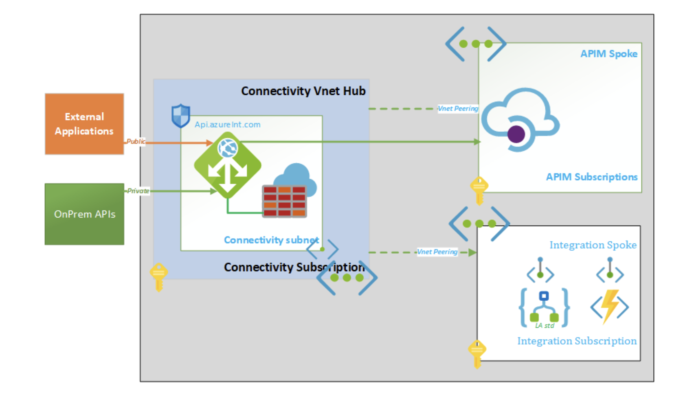
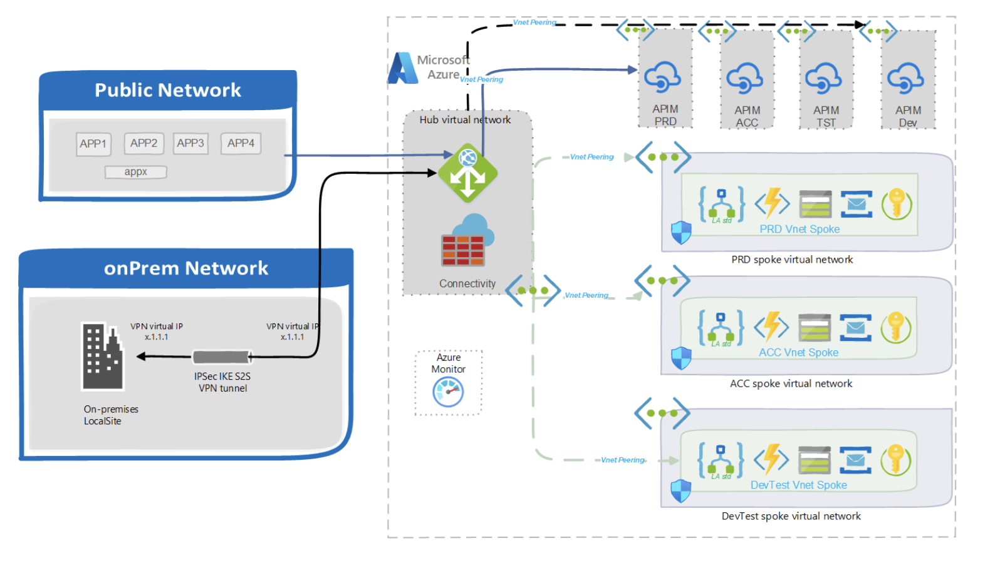
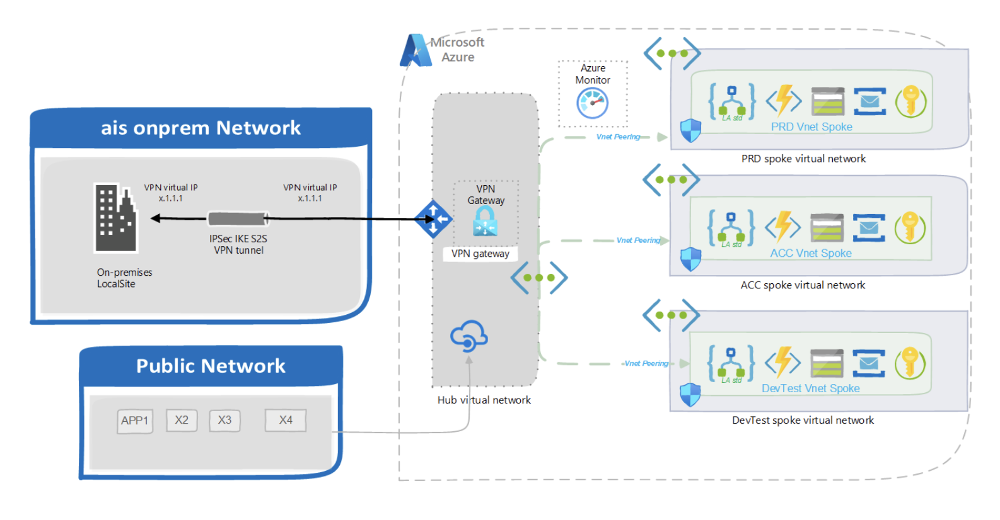

# Azure API management technical design

## APIM Landing Zone

- An Azure Landing Zone in the context of APIM refers to the initial setup or configuration of Azure resources such as APIM instances and application instances required to host and manage APIs using APIM.
- APIM will be deployed to a dedicated subscription to enable the shared services/implementation.
- Each resource group will have resources dedicated to APIM such as Application insight, storage, and Key vault.
- The Production instance would use a Premium or Standard V2 instance and Non-Production would use Developer editions.
- Every environment will have a dedicated APIM instance.

An APIM instance should be  deployed for each environment, containing APIs only for that environment, for the following reasons :

- Placing APIs for different environments into one Azure API Management Service resource makes it hard to automate the deployment of an API across environments.
- Consequently, a lot of manual changes would have to be done, each time a new version of an API is generated. This takes a lot of time and is error-prone.
- The best Practice is to have security boundaries per environment, so access to production is not permitted for developers and testers.
- Changes in one environment should not impact other environments, for example during load testing etc.

## Custom domain name

When exposing APIs to the outside world, you usually do not want consumers to connect to your APIs using the default APIM gateway URL (like https://apim-%5Bcustomer%5D-%5Bproject%5D-common-dev.azure-api.net),  but you want to expose your APIs using a custom domain. If you use the Application gateway, then the application gateway will have the custom domain name.

## APIM Environment Insances

The following APIM Instances will be deployed with the following configuration.

|APIM Instance	|DNS Name	|APIM Plan	|Subscription|
|---|---|---|---|
|nagarro-ause-dev-01   |api-dev01.ause.nagarro.com	|DEV|	nagarro-corp-apim-dev-ause-001|
|nagarro-ause-tst-01   |api-tst01.ause.nagarro.com	|DEV|   nagarro-corp-apim-dev-ause-001|
|nagarro-aue-prd-01|   |api-prd01.aue.nagarro.com	|Premium/Standard V2|	nagarro-corp-apim-prd-aue-001|

## Networking

There are two possible deployments of APIM within the VNET
- The first and recommended option is to deploy the APIM in private mode (premium) and in a VNET.
- The second option could be to deploy APIM in public mode (APIM V2 standard) with outbound VNET integration to backend APIs.

### Recommended Option: 
Use a **premium tier** of APIM in **private mode** and Setup an **Application Gateway** and **WAF** in front of APIM

- Consider using a premium instance (connected to a VNet) for both acceptance and production, using the application gateway (and WAF) to bridge the gap between public internet and private internet. 
- To protect critical Web/HTTP APIs configure API Management within a Virtual Network (Vnet) in internal mode and configure an Azure Application Gateway (using WAF), due to the following reasons

  - It is a Microsoft best practice and in line with the API Management Cloud Adoption Framework design guidelines.
  - The API Management service is not a Web Application Firewall. Deploy a WAF such as Azure Application Gateway in front for additional layers of protection (in the connectivity management group).
  - Only APIM Premium offers zone redundancy and offers network isolation using VNets.
  - When deploying APIM in a VNet (only Premium / Developer tiers), an Application Gateway using WAF in front of APIM is required to transform traffic from public internet to private (internal VNet) traffic and secure incoming requests using the WAF features
  - Using the WAF features, you are protected from malicious attacks that exploit commonly known vulnerabilities
  - You will be protected from DDoS attacks

### Option 2: 
Use an APIM standard v2 in public mode and secure backends within a VNET

- APIM Standard V2 supports Outbound VNet integration. 
- Outbound VNet integration allows your API Management instance to reach API backends isolated in a VNet. 
- The API Management gateway, management plane, and developer portal remain publicly accessible online.

# Azure API Management Development Guidelines
## APIM Definition Guidelines

Follow the below APIM definition guidelines

- API Naming Conventions: APIs should follow a consistent naming convention that reflects the owning service and its purpose (e.g., CustName-D365FO-Finance or CustName-D365CE-Customer).
- Resource Naming Convention: API endpoints returning collections of resources should always use plural nouns for consistency and clarity in understanding the endpoint’s purpose.
- Enforce HTTPS: Ensure that all APIs are accessible only over HTTPS by enforcing this protocol through Azure Policy within Azure API Management. This enhances security and data integrity.
- API Versioning: Adopt a versioning strategy for APIs from the outset, beginning with version 1. This allows for future updates and changes without disrupting existing consumers.
- Secure Data Handling: Utilize Azure Key Vault to securely store sensitive data such as credentials, keys, and secrets, ensuring their protection from unauthorized access.
- Simplicity in Policies: Refrain from embedding complex business logic or orchestration within API Management policies. Keep policies simple and focused on tasks like authentication, authorization, and transformation.
- Reusable Policy Fragments: Encapsulate common policy configurations into reusable fragments, promoting modularity and efficiency in policy management. This approach enhances maintainability and reduces redundancy.
- Authentication for API Consumers: Require both OAuth tokens and subscription keys for authentication when consuming APIs. This dual-layered approach enhances security by adding an additional layer of protection.
- Secure Backend Connections: Implement a secure authentication mechanism for outbound connections from API Management to backend APIs.
- Whenever feasible, leverage Azure Managed Identity for API Management to streamline authentication and improve security posture.
- Standard APIM V2 plan supports VNET integration for backends. This means you can ensure that all the backends are placed within a VNET.

### Enable the Developer portal for APIM

- APIM Developer Portal serves as a gateway for developers to explore, understand, and consume APIs offered by an organization. 
- The portal can be used as a Comprehensive API Documentation. 
- It offers documentation for each API, including detailed descriptions, usage instructions, request and response examples, supported parameters, error codes, and authentication requirements. 
- It enables developers to experiment with APIs directly within the Developer Portal by integrating interactive API. This allows developers to test API endpoints, submit requests, and view real-time responses, facilitating faster prototyping and debugging.

## Use Named Values for Secrets
- Never hard-code secrets like connection strings or passwords in your policy expressions. Instead, use Named Values. 
- Using Named Values for Secrets in Azure API Management (APIM) allows you to securely store and manage sensitive information such as API keys, passwords, or connection strings
- Named Values act as placeholders for these secrets within your API Management configuration.

## agging
Tagging will be used to uniquely identify the APIs in the APIM. The following Tags can be used for APIs.

|Tag	|Description	|Value|
|---|---|---|
|Environment	|Dev, Test, UAT, Prod| Prod|
|AppName	|Application or Component Name	|Nagarro|
|Owner|	Owner of the API	|AzureInt|
|Department	|BU/Department	|IT|
|CostCenter	|Cost Center	|Corporate IT|
|Vendor	|Vendor/ISV	|NeggaroCons|
|IDD	|IDD Number	|IDD-09|

## Group APIs into Products
- The “Products” functionality within an API Management system offers a method for organizing and controlling access to APIs by grouping them logically. 
- By structuring APIs into products, you can manage how users interact with your API ecosystem.

- By structuring APIs into products, you not only streamline access management but also enhance security and scalability. 
- Each product can have its own set of usage limits, authentication requirements, and policies, providing flexibility to cater to diverse business objectives (such as Data APIs).

## Security

Security is crucial to safeguard APIs, data, and backend systems. Several key features and practices contribute to securing APIs within APIM:

- **Token Validation:**
  - APIM supports various authentication mechanisms, including OAuth 2.0, API keys, and JWT tokens.
  - Token validation ensures that incoming requests are accompanied by valid authentication tokens before granting access to APIs.
  - JWT token validation involves verifying the token’s signature, expiration, and issuer against predefined policies.
 - **Subscription Key:**
- APIM issues subscription keys to developers or applications upon subscription to APIs.These keys act as unique identifiers and are included in API requests to authenticate and authorize access.
- **Virtual Network (VNET):**
  - By leveraging the outbound VNET feature, APIM can communicate securely with backend services deployed within a virtual network.
  - VNET integration enhances security by enforcing network isolation and enabling private connectivity with backend systems.
- **Securing Backends with Managed Identity:**
  - Managed identities provide an identity for services running on Azure, eliminating the need to store credentials in code or configuration files.
  - APIM can leverage managed identities to securely access backend services without exposing sensitive credentials.
  - By assigning a managed identity to APIM, it can authenticate itself to backend services using Azure Active Directory (AAD) authentication.
- Subscription keys can be scoped to specific APIs, products, or usage tiers, enabling fine-grained access control.

Implementing these security measures collectively enhances the overall security posture of API Management, safeguarding APIs, data, and backend systems from unauthorized access, data breaches, and other security threats.

## Monitoring
Monitoring Azure API Management services is essential for identifying issues and proactively addressing them. The following settings help APIM monitoring:

- **Enable Diagnostic Logs:** Capture detailed information about requests, responses, errors, and events to troubleshoot issues and analyze traffic patterns.
- **Monitor Backend Health:** Configure health probes to check backend services periodically and take corrective actions if needed.
- **Enable Application Insights:** Gain deeper insights into API usage, performance, and errors by integrating Application Insights with your APIM service.
- **Create Alerts:** Set up alerts to notify you when predefined thresholds are exceeded, allowing quick issue resolution before significant impact.
- **Implement Security Monitoring:** Monitor security metrics and events to detect and prevent potential threats or vulnerabilities.

By following these practices, you can effectively monitor Azure API Management services, identify issues promptly, and ensure API reliability.

## Governance
Central Team Responsibilities:
  A central team will be responsible for deploying, managing, and monitoring the APIM instance, ensuring consistent and secure access to APIs across the organization. This team is entrusted with the following accountabilities:

## Cost Management
- Azure API Management offers several pricing tiers tailored to different use cases: Consumption, Basic, Standard V2, and Premium. Each tier offers varying features and scalability options.

- We recommend the Premium tier due to its robust capabilities, including advanced security features and extensive network isolation options. However, after weighing the Customer’s requirements against the associated costs, we determined that the Standard V2 tier balances functionality and affordability.

- One key advantage of the Standard V2 tier is its support for outbound Virtual Network (VNet) connectivity. This feature allows the Customer to integrate its API management solution with its existing network infrastructure, ensuring secure and efficient communication between services.

